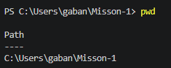

dfgdf★# Mission 1 - 개발 환경 세팅
---

# 1. 프로젝트 개요

## 프로젝트 목표

본 미션에서는 Windows 환경에서 개발 워크스테이션을 구축하고 Docker와 Git을 활용하여 개발 환경을 구성하였다.

주요 수행 내용

- Docker Desktop 설치
- Git 설치 및 GitHub 연동
- VS Code 개발환경 구축
- Dockerfile 작성
- Docker 커스텀 이미지 생성
- 컨테이너 실행 및 포트 매핑 확인
- Bind Mount 및 Docker Volume 실습
- Git을 이용한 버전 관리

---

# 2. 실행 환경

|항목|내용|
|---|---|
|OS|Windows 11|
|Terminal|PowerShell|
|Editor|Visual Studio Code|
|Docker|Docker Desktop (버전 입력)|
|Git|(버전 입력)|

**설명:** 본 미션을 수행한 개발 환경이다.


---

# 3. 프로젝트 구조

```text
Mission-1
├── app
├── docs
├── screenshots
├── Dockerfile
└── README.md
```

**설명:** 프로젝트 디렉터리 구조이다.


---

# 4. 수행 체크리스트

- [ ] 터미널 명령 실습
- [ ] 파일 권한 실습
- [ ] Docker 설치
- [ ] Docker 기본 명령
- [ ] hello-world 실행
- [ ] Ubuntu 컨테이너 실습
- [ ] Dockerfile 작성
- [ ] 커스텀 이미지 생성
- [ ] 포트 매핑
- [ ] Bind Mount
- [ ] Docker Volume
- [ ] Git 설정
- [ ] GitHub 연동

---

# 5. 터미널 명령 실습

## 5-1. 현재 위치 확인

```powershell
pwd
```

**설명:** 현재 작업 중인 디렉터리 위치를 확인하였다.



## 5-2. 파일 목록 확인

```powershell
dir -Force
dir
```

**설명:** 숨김 파일을 포함한 전체 목록을 확인하였다(dir-Force) / (dir; 일반확인)


## 5-3. 파일 및 폴더 생성

```powershell
mkdir app docs test-floder 
ni test.txt
dir
```

**설명:** 프로젝트에 필요한 폴더와 파일을 생성하고 생성 결과를 확인하였다.


## 5-4. 디렉터리 이동

```powershell
cd test-folder
pwd
cd ..
```

**설명:** 디렉터리를 이동하고 현재 위치를 확인하였다.


## 5-5. 파일 복사

```powershell
Copy-Item test.txt test-copy.txt
dir
```

**설명:** 기존 파일을 복사하여 동일한 내용을 가진 새로운 파일을 생성하였다.


## 5-6. 파일 이동 및 이름 변경

```powershell
Rename-Item test-copy.txt test2.txt
Move-Item test2.txt test-folder
dir
dir test-folder
```

**설명:** 파일 이름을 변경한 후 다른 디렉터리로 이동하고 결과를 확인하였다.


## 5-7. 파일 내용 확인

```powershell
Set-Content test.txt "Hello Mission 1"
Get-Content test.txt
```

**설명:** 테스트 파일에 내용을 입력한 후 파일 내용을 확인하였다.


## 5-8. 파일 삭제

```powershell
cd test-folder
Remove-Item test2.txt
dir
cd ..
```

**설명:** 파일을 삭제하였다.


---

# 6. 파일 권한 실습

## 6-1. 권한 확인

```bash
mkdir permission-test
cd permission-test
touch test.txt
mkdir sample
ls -l
```

**설명:** Ubuntu 컨테이너 내부에서 권한 실습용 디렉터리와 테스트 파일을 생성하고 기본 권한을 확인하였다.


## 6-2. 파일/디렉터리 권한 변경

```bash
chmod 600 test.txt
ls -l test.txt

chmod 644 test.txt
ls -l test.txt

chmod 700 sample
ls -ld sample

chmod 755 sample
ls -ld sample
```

**설명:** Ubuntu 컨테이너에서 파일 권한을 600으로 변경한 후 644로 다시 변경하여 권한 변화를 확인하고, 디렉터리 권한을 700으로 변경한 후 755로 다시 변경하였다.


[권한변경 결과]
- `600` : 소유자만 읽기 및 쓰기가 가능하며, 그룹과 다른 사용자는 접근할 수 없다.
- `644` : 소유자는 읽기/쓰기가 가능하고, 그룹과 다른 사용자는 읽기만 가능하다.
- `700` : 디렉터리 소유자만 접근할 수 있다.
- `755` : 소유자는 모든 권한을 가지며, 그룹과 다른 사용자는 읽기 및 실행 권한을 가진다.

---

# 7. Docker 설치 및 점검

## 7-1. Docker 버전

```powershell
docker --version
```

**설명:** Docker 설치 여부와 버전을 확인했다.


## 7-2. Docker 정보

```powershell
docker info
```

**설명:** Docker Engine이 정상적으로 실행 중인지 확인하고 시스템 정보를 조회하였다.


## 7-3. Docker 이미지·컨테이너 확인

```powershell
docker images
docker ps -a
```

**설명:** (이미지) 로컬 시스템에 저장된 Docker 이미지를 확인하였다. Ubuntu 이미지가 정상적으로 저장되어 있는 것을 확인하였다.
(컨테이너) 실행 중인 Docker 컨테이너 목록을 확인했다.

(ps -a는 종료된 컨테이너까지 모두 확인 가능 / ps는 실행중인 것만 확인 가능)


---

# 8. Docker 기본 명령

## 8-1. 컨테이너 로그 확인

```powershell
docker logs ubuntu-permission
```

**설명:** 컨테이너 로그를 확인하였다.


## 8-2. Docker 리소스 사용량 확인

```powershell
docker stats
```

**설명:** CPU 및 메모리 사용량을 확인하였다.


## 8-3. 컨테이너 중지 및 상태 확인

```powershell
docker stop ubuntu-permission
docker ps -a
```

**설명:** 실행 중인 Ubuntu 컨테이너를 중지하고 상태가 Exited로 변경된 것을 확인하였다.


## 8-4. hello-world 실행

```powershell
docker run hello-world
```

**설명:**  `hello-world` 이미지를 실행하여 Docker Engine이 정상적으로 동작하는 것을 확인하였다.


## 8-5. Ubuntu 컨테이너 실행 및 내부 명령 실행

```powershell
docker start ubuntu-permission
docker exec -it ubuntu-permission bash
echo "Hello Docker"
pwd
ls
```

**설명:** 기존 Ubuntu 컨테이너를 시작한 후 `docker exec` 명령으로 내부에 접속하여 문자열 출력, 현재 위치 확인, 파일 목록 확인 명령을 실행하였다.


---

# 9. Dockerfile 기반 커스텀 이미지

## 9-1. Dockerfile 확인

```dockerfile
FROM nginx:latest
COPY app/index.html /usr/share/nginx/html/index.html
```

**설명:** Nginx 공식 이미지를 베이스 이미지로 사용하고, 직접 작성한 index.html 파일을 Nginx 기본 웹 경로로 복사하도록 Dockerfile을 구성하였다.


## 9-2. index.html 확인


**설명:** Nginx 컨테이너에서 제공할 정적 웹 페이지 소스코드를 확인하였다.


## 9-3. Docker 이미지 빌드

```powershell
docker build -t mission-1web .
```

**설명:** Dockerfile을 기반으로 `mission-1web`이라는 이름의 커스텀 이미지를 생성하였다.


## 9-4. Docker 이미지 생성 확인

```powershell
docker images .
```

**설명:** mission-1web 커스텀 이미지가 정상적으로 생성된 것을 확인하였다.


## 9-5 컨테이너 실행(포트매핑)

```powershell
docker run -d -p 8080:80 --name mission1-container mission-1web
```

**설명:** mission-1web 이미지를 기반으로 컨테이너를 백그라운드에서 실행하고, 호스트의 8080 포트를 컨테이너의 80 포트와 연결하였다. docker ps 결과에서 컨테이너 상태가 Up이며 0.0.0.0:8080->80/tcp 포트 매핑이 적용된 것을 확인하였다.

.png>)


## 9-6. 브라우저 확인

http://localhost:8080

**설명:** 포트 매핑이 정상 동작하는 것을 확인하였다.


---

# 10. Bind Mount

실행 명령

```powershell
docker run -d -p 8080:80 --name mission1-container -v ${PWD}\app:/usr/share/nginx/html nginx
```

**설명:** 호스트의 `app` 폴더를 컨테이너의 웹 루트에 바인드 마운트하였다. 호스트에서 `index.html`을 수정한 후 브라우저를 새로고침하자 컨테이너를 재시작하지 않아도 변경 사항이 즉시 반영되는 것을 확인하였다.


---

# 11. Docker Volume

생성 → 연결 → 데이터 생성 → 컨테이너 삭제 → 재실행 → 데이터 유지 확인

## 11-1. Docker Volume 생성 및 데이터 

### 명령어

```powershell
docker volume create mission1-volume
docker volume ls
```

**설명:** `mission1-volume`이라는 Docker Volume을 생성하고, `docker volume ls` 명령으로 Volume이 정상적으로 생성된 것을 확인하였다.


## 11-2. Volume 연결 및 데이터 생성

### 명령어

```powershell
docker run -d --name volume-test -v mission1-volume:/data ubuntu sleep infinity
docker exec -it volume-test bash
```

```bash
echo "Mission 1 Volume Test" > /data/test.txt
cat /data/test.txt
```

**설명:** 생성한 Docker Volume을 컨테이너의 `/data` 디렉터리에 연결하고, Volume 내부에 `test.txt` 파일을 생성한 후 데이터가 정상적으로 저장되었음을 확인하였다.


## 11-3. Docker Volume 영속성 확인

### 명령어

```powershell
docker rm -f volume-test
docker run -d --name volume-test2 -v mission1-volume:/data ubuntu sleep infinity
docker exec -it volume-test2 bash
```

```bash
cat /data/test.txt
```

**설명:** 기존 컨테이너를 삭제한 후 동일한 Docker Volume을 연결한 새로운 컨테이너를 실행하였다. `test.txt` 파일이 그대로 유지되는 것을 확인하여 Docker Volume의 데이터 영속성을 검증하였다.


---

# 12. Git 설정, GitHub 및 VS Code 연동

```powershell
git config --global user.name "username"
git config --global user.email "email@example"
git commit -m "update README for Mission 1"
git push origin main
```

**설명:** Git 커밋에 기록할 사용자 이름과 이메일을 설정하고, commit으로 로컬 Git 저장소(main으로 설정)에 작업 이력을 저장한 뒤 git push로 git hub에 연동을 완료함

(스크린샷)


---

# 13. 트러블슈팅

## 사례 1 Docker Build 오류

- 문제: docker build 명령 실행 시 다음과 같은 오류 발생
```text
ERROR: docker: 'docker buildx build' requires 1 argument
```
- 원인: `docker build -t mission-1web` 명령에서 **빌드 대상 경로(PATH)** 를 지정하지 않아 Docker가 Dockerfile의 위치를 찾지 못함
- 확인: 명령어 마지막에 현재 디렉터리를 의미하는 `.`(점)이 누락된 것을 확인
- 해결: 명령어 마지막에 현재 디렉터리를 의미하는 `.`을 추가하여 다시 실행하고、이미지가 정상적으로 생성되는 것을 확인함

## 사례 2 PowerShell 명령 오류

- 문제: Linux 명령어로 터미널에 입력하여 'ls -la'등 명령어가 정상적으로 작동되지 않음
- 원인: Linux 명령어는 Windows PowerShell에서는 작동하지 않음 (`-la` 옵션을 지원하지 않음)
- 확인: PowerShell에서 `ls -la` 실행 시 `NamedParameterNotFound` 오류가 발생
- 해결: PowerShell에서 지원하는 명령인 `dir` 또는 `dir -Force`를 사용하여 파일 목록을 확인


## 사례 3 포트 충돌 오류

- 문제: 컨테이너 실행 시 포트가 이미 사용 중이라는 오류가 발생하였다.
- 원인: 호스트 PC에서 동일한 포트를 사용하는 컨테이너 또는 프로그램이 이미 실행 중이었음
- 확인: Windows에서 포트 사용 여부를 확인함

```powershell
netstat -ano | findstr :8080ㄴ
```

또는 Docker 컨테이너를 확인함

```powershell
docker ps
```

- 해결: 기존 컨테이너를 중지하거나 삭제한 뒤 다시 실행
```powershell
docker stop mission1-container
docker rm mission1-container
```

---

# 14. 1주차 미션 개념 정리

## 14-1. 절대경로와 상대경로

- **절대경로(Absolute Path)** : 파일이나 폴더의 전체 위치를 처음부터 끝까지 나타내는 경로
  예) `C:\Users\gaban\Misson-1\app\index.html`

- **상대경로(Relative Path)** : 현재 작업 중인 위치를 기준으로 파일이나 폴더의 위치를 나타내는 경로
  예) `app\index.html`

- 사용 기준 및 재현성
 **호스트(Windows)** 에서는 프로젝트 내부 파일을 참조할 때 상대경로(`app/index.html`)를 사용하는 것이 좋다. 프로젝트를 다른 컴퓨터로 옮겨도 동일한 구조를 유지할 수 있어 재현성이 높다.

 **컨테이너 내부**에서는 실행 위치가 고정되어 있으므로 `/usr/share/nginx/html/index.html`과 같은 절대경로를 주로 사용한다.

이번 실습에서도 호스트에서는 상대경로를 사용하고 Dockerfile에서는 컨테이너 내부 절대경로를 사용하여 환경이 달라도 동일한 결과를 재현할 수 있도록 구성하였다.


## 14-2. 파일 권한 (r / w / x)

Linux에서는 파일과 디렉터리의 접근 권한을 다음과 같이 구분

- **r (Read)** : 파일을 읽을 수 있는 권한
- **w (Write)** : 파일을 수정하거나 저장할 수 있는 권한
- **x (Execute)** : 파일을 실행하거나 디렉터리에 접근할 수 있는 권한


## 14-3. 755와 644의 의미

- **755 (`rwxr-xr-x`)**
  - 소유자 : 읽기(r), 쓰기(w), 실행(x)
  - 그룹 : 읽기(r), 실행(x)
  - 기타 사용자 : 읽기(r), 실행(x)

  → 주로 실행 가능한 프로그램이나 디렉토리에 사용

- **644 (`rw-r--r--`)**
  - 소유자 : 읽기(r), 쓰기(w)
  - 그룹 : 읽기(r)
  - 기타 사용자 : 읽기(r)

  → 일반적인 문서나 설정 파일에 많이 사용


## 14-4. Dockerfile

Dockerfile은 Docker 이미지를 생성하기 위한 설정 파일이다.

```powershell
docker build
```

Docker Image는 컨테이너를 생성하기 위한 **읽기 전용(Read-only) 템플릿**이다.
앱 실행에 필요한 프로그램, 라이브러리, 설정 파일 등을 포함하며, 한 번 생성된 이미지는 변경되지 않는다. (여러 컨테이너에서 공통 사용, 변경x)

```powershell
docker run
```

Docker Container는 이미지를 기반으로 실행되는 **실행 환경(Runtime)** 이다. 컨테이너 내부에서 파일을 수정하거나 프로그램을 실행할 수 있지만, 이러한 변경 사항은 해당 컨테이너에만 적용된다. 이미지는 그대로 유지되며, 새로운 컨테이너를 생성하면 원래 이미지 상태로 다시 시작된다.(삭제 후 재생성 가능, 실행 중 변경 가능)


## 14-5. 포트 매핑 (Port Mapping)

포트 매핑은 **호스트 PC의 포트와 컨테이너 내부 포트를 연결하는 기능**임

예를 들어

```powershell
docker run -p 8080:80
```

은

- 호스트(PC)의 **8080 포트**
- 컨테이너의 **80 포트(Nginx)**

를 연결하여 브라우저에서

```
http://localhost:8080
```

으로 웹 페이지에 접속할 수 있음

- **네트워크 네임스페이스와 포트 매핑**
Docker 컨테이너는 각각 독립된 **네트워크 네임스페이스(Network Namespace)** 를 사용한다. 따라서 컨테이너 내부의 포트는 호스트 PC와 분리되어 있으며 외부에서는 직접 접근할 수 없다.

`docker run -p 8080:80` 명령은 호스트의 8080 포트를 컨테이너의 80 포트와 연결하여 외부에서 웹 서버에 접근할 수 있도록 한다.


- **보안**
모든 포트를 외부에 공개하지 않고 필요한 포트만 `-p` 옵션으로 공개하면 불필요한 접근을 줄일 수 있어 보안상 안전하다.


## 14-6. Docker Volume**
Docker Volume은 **컨테이너와 독립적으로 데이터를 저장하는 저장 공간**을 의미

컨테이너를 삭제하더라도 Volume은 유지되므로 데이터를 계속 사용할 수 있음


